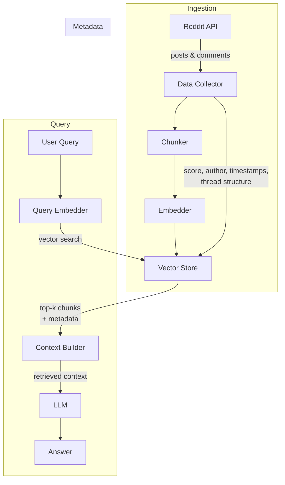

# eaddit Implementation Plan

## Overview

Ingest a subreddit into a vector database to support RAG (Retrieval-Augmented Generation) queries.

---

## Architecture Diagram

---

## Phase 1: Data Ingestion Pipeline

### 1.1 Reddit Data Collection

- Connect to the Reddit API to collect posts and comments from target subreddits
- Fields to collect per post: identifier, title, body, score, URL, timestamp, subreddit, author
- Fields to collect per comment: identifier, body, score, timestamp, author, parent identifier, thread depth
- Filter by score threshold to avoid ingesting low-quality content

### 1.2 Chunking Strategy

- **Posts**: treat title and body together as a single chunk
- **Comments**: thread-aware chunking — prepend parent context to each comment so chunks are self-contained
- Target a consistent chunk size (in tokens) with a small overlap to preserve context across chunk boundaries

**Key decision**: full thread context embedded per chunk vs flat comments. Full thread context improves retrieval quality but increases storage and embedding cost.

### 1.3 Embedding

- **Option A (hosted API)**: use a hosted embedding API — easier to set up, no local infrastructure
- **Option B (local model)**: run an embedding model locally — free, private, no external dependencies
- Batch documents for embedding to maximise throughput

### 1.4 Vector Store

- **Option A (self-hosted)**: run a dedicated vector database service locally
- **Option B (extension)**: use a vector extension on an existing relational database
- **Option C (embedded)**: use an in-process vector store — simplest, good for prototyping
- Choice should consider filtering capability, operational complexity, and scalability requirements

### 1.5 Metadata Schema

Each stored vector should carry metadata to support filtering at query time:

| Field | Type | Notes |
|---|---|---|
| `post_id` | string | |
| `comment_id` | string | null for post chunks |
| `score` | integer | upvote count at ingest time |
| `created_utc` | integer | Unix timestamp |
| `author` | string | |
| `url` | string | |
| `parent_id` | string | null for posts/root items; set for comments (post or comment parent) |
| `depth` | integer | 0 for posts; 1+ for comments |

This metadata enables filtering by recency, score, or thread structure at query time.

---

## Phase 2: RAG Query Flow

1. Embed the user's query using the same embedding model used at ingest time
2. Search the vector store for the top-k most similar chunks
3. Optionally filter results by metadata (e.g. minimum score, date range)
4. If a matching chunk is a comment, optionally fetch its ancestor chain (parent comments up to the root post) for additional context
5. Pass the retrieved chunks to an LLM along with the original query

---

## Phase 3: Dev Environment Setup

- Reproducible development environment covering the data collection, embedding, and vector store client dependencies
- Vector store should be runnable locally for development and testing

---

## Key Design Decisions

| Decision | Options |
|---|---|
| Embedding model | Hosted API (easier) vs local model (private, no cost per call) |
| Incremental updates | Periodic polling for new posts vs one-shot ingest |
| Comment depth | Full thread context per chunk vs flat (top-level only) comments |
| Deduplication | Hash content before inserting to avoid re-ingesting unchanged items |

---

## Implementation Order

1. [ ] Set up reproducible dev environment
2. [ ] Implement Reddit data collector
3. [ ] Implement chunker with thread-aware comment handling
4. [ ] Implement embedder with batching
5. [ ] Set up vector store (local)
6. [ ] Implement vector store ingestion
7. [ ] Implement RAG query interface
8. [ ] Wire together into a CLI or service entry point
9. [ ] Add incremental update support
10. [ ] Add deduplication logic
